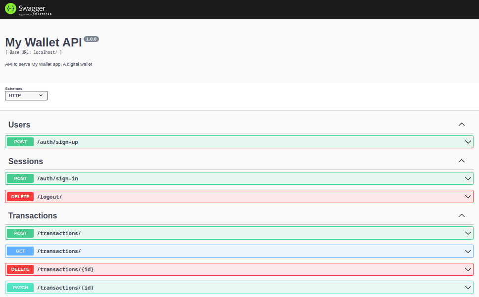
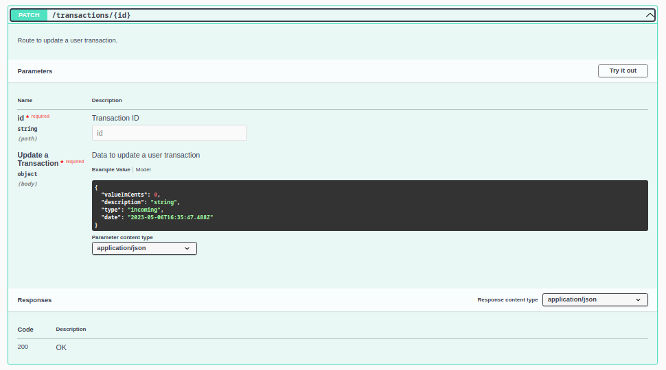

| [:gb:](README.md) | [:brazil:](README_pt.md) |

# My Wallet App Back-end

Back-end for My Wallet, a finance manager. :moneybag:


## About

My Wallet is a web browser application with which you can manage your personal expenses and income.

You can access the front-end repository at [Front-End APP](https://github.com/victor-azevedo/front-mywallet)

## Deploy

You can access the application deploy [here](https://victor-dev-mywallet.vercel.app).
Please note that, as it is a free deployment, there might be a longer loading time when starting the application ⏳. We appreciate your patience 🙏!

## How to run

### Locally Option:

#### Requirements

Have Node.js (recommended version: 16.20.0) and MongoDB (recommended version: 6.0.5) installed in your machine.

1. Clone this repository;

```bash
git clone git@github.com:victor-azevedo/back-mywallet.git
cd back-mywallet/
```

2. Install all dependencies:

```bash
npm i
```

3. Create a `.env` file based in `.env.example`;

4. Start application:

```bash
npm start
```

Application default PORT: 4000.

### Docker Option:

#### Requirements

Have Docker and Docker Compose installed.

1. Clone this repository;

```bash
git clone git@github.com:victor-azevedo/back-mywallet.git
cd back-mywallet/
```

2. Create a `.env` file based in `.env.example`;

3. Run Docker Compose file:

```bash
sudo docker compose up
```

Application default PORT: 4000.

A folder `data/` will be created as mongo container volume.

## Documentation

The documentation can be access at end point `/docs` (e.g. `https://my-wallet-api-7skt.onrender.com/docs/`)




