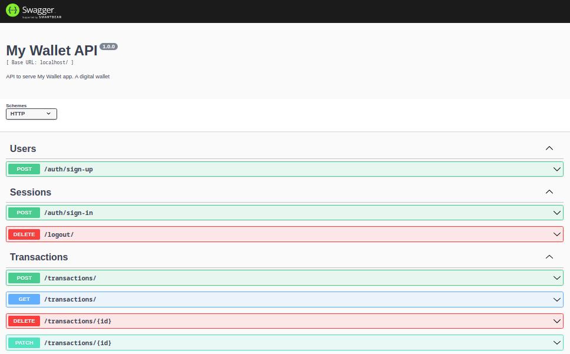

| [:gb:](README.md) | [:brazil:](README_pt.md) |

# My Wallet - Back-end

Back-end para o My Wallet, um gerenciador financeiro. :moneybag:


## Sobre

O My Wallet é um aplicativo de navegador da web com o qual você pode gerenciar suas despesas e receitas pessoais.

Você pode acessar o repositório do front-end em [Front-End APP](https://github.com/victor-azevedo/front-mywallet)

## Deploy

Você pode acessar a aplicação [aqui](https://victor-dev-mywallet.vercel.app)

## Como executar

### Opção Local:

#### Requisitos

Tenha o Node.js (versão recomendada: 16.20.0) e o MongoDB (versão recomendada: 6.0.5) instalados em sua máquina.

1. Clone este repositório;

```bash
git clone git@github.com:victor-azevedo/back-mywallet.git
cd back-mywallet/
```

2. Instale todas as dependências:

```bash
npm i
```

3. Crie um arquivo `.env` com base no arquivo `.env.example`;

4. Inicie a aplicação:

```bash
npm start
```

Porta padrão da aplicação: 4000.

### Opção Docker:

#### Requisitos

Tenha o Docker e o Docker Compose instalados.

1. Clone este repositório;

```bash
git clone git@github.com:victor-azevedo/back-mywallet.git
cd back-mywallet/
```

2. Crie um arquivo `.env` com base no arquivo `.env.example`;

3. Execute o arquivo Docker Compose:

```bash
sudo docker compose up
```

Porta padrão da aplicação: 4000.

Uma pasta `data/` será criada como volume do container do MongoDB.

## Documentação

A documentação pode ser acessada no endpoint `/docs` (por exemplo, `https://my-wallet-api-7skt.onrender.com/docs/`)




